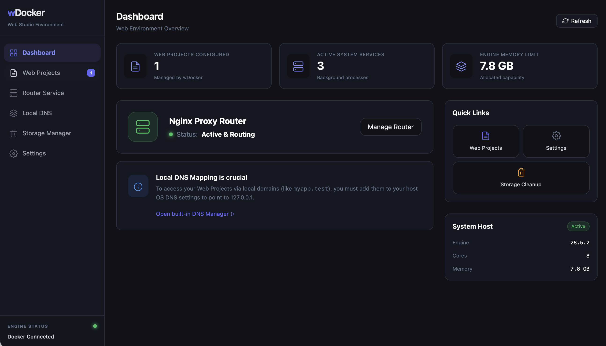
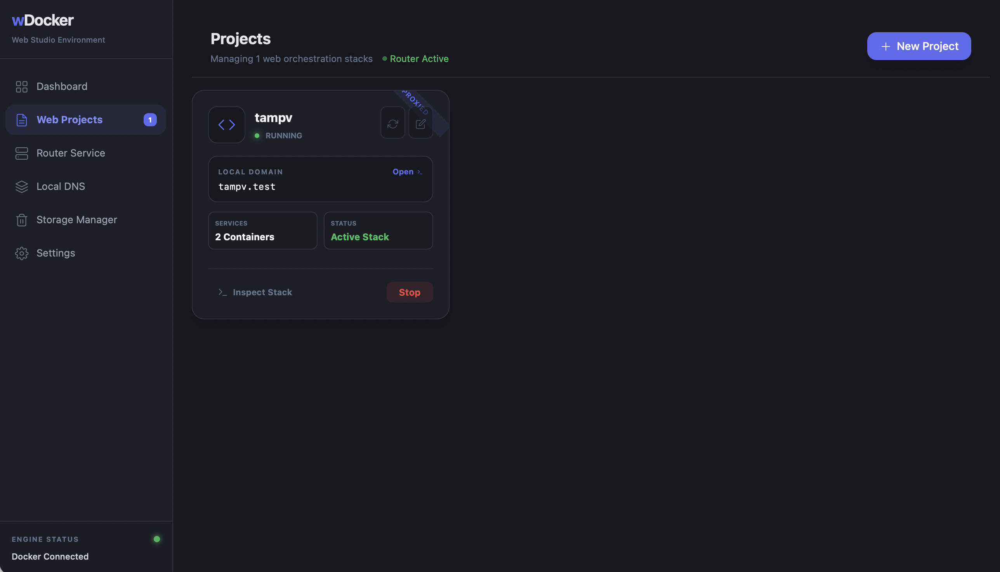
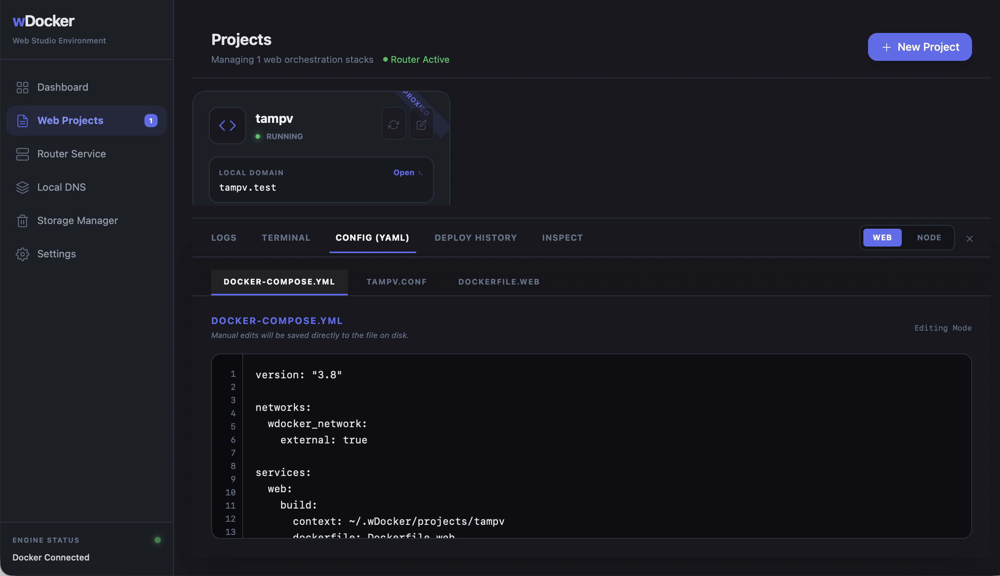
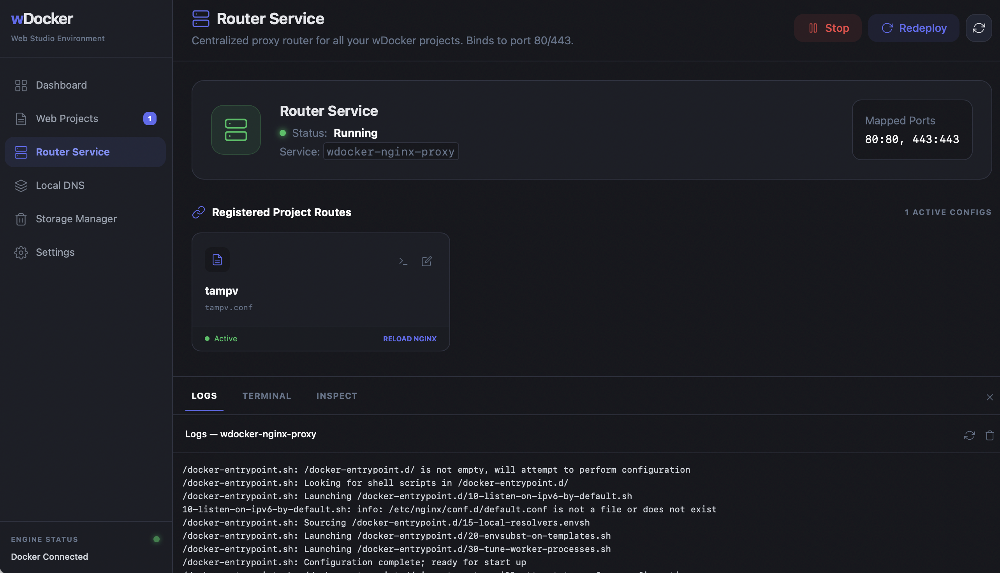
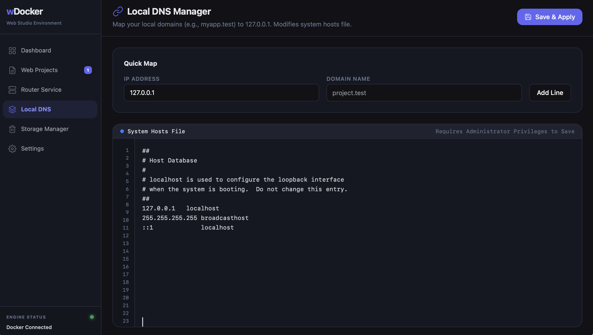
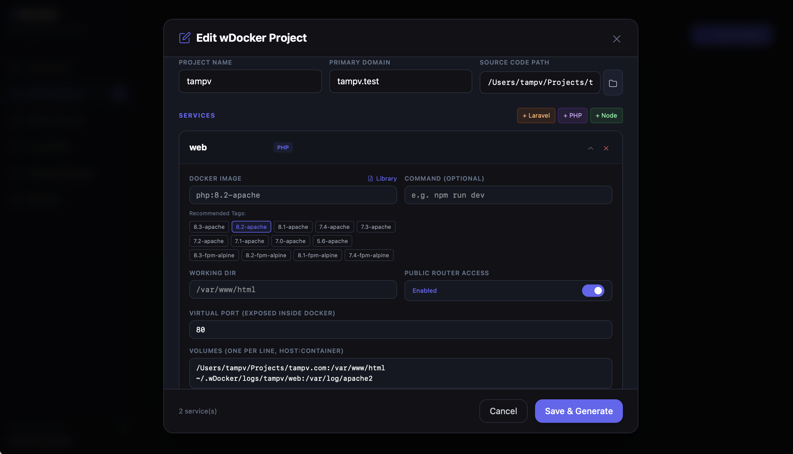
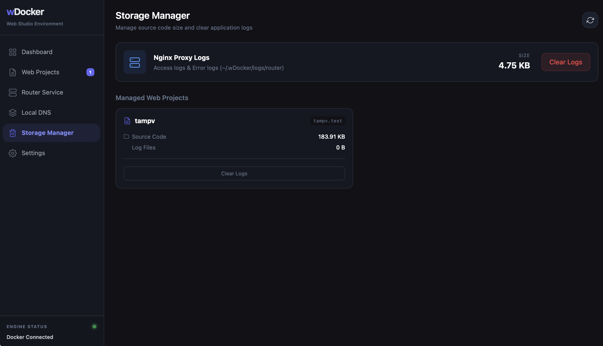

# Introduction to wDocker 🐳

Welcome to **wDocker**, a modern, lightweight, and incredibly fast desktop GUI designed specifically for web developers. It aims to bridge the gap between heavy, generic container managers and complex command-line workflows. 

If you have ever loved the simplicity of Laravel Valet or XAMPP, but needed the isolation and power of Docker, wDocker is built for you.

---

## Key Features & Visual Walkthrough

### 🚀 Developer Dashboard
Get an immediate overview of your system's health, Docker daemon status, processor usage, and active project counts.

### 📦 Seamless Project Management
Forget writing complex Docker Compose files from scratch. The Projects module allows you to spin up Laravel, PHP, or Node.js environments instantly.

wDocker includes a powerful **Project Wizard** equipped with curated Docker images, PHP extension configurations, and automated volume mapping.

### 🌐 Nginx Router Service
wDocker runs a centralized Nginx proxy container that routes traffic to all your local projects based on domain names (e.g. `http://myapp.test`). No more port conflicts or remembering `localhost:8080`.

### 🗺️ Automated Local DNS
To make the `.test` domains work, wDocker instantly controls and updates your system's `/etc/hosts` file (with elevated privileges when necessary) ensuring transparent DNS resolution for all your projects.

### 🕵️ Deep Container Inspection
Dive deep into your running services without opening a separate terminal app. wDocker provides built-in real-time access logs, an interactive container terminal, and live YAML configuration editors.

### 🧹 Docker Storage & Cleanup
Keep your development environment lean. Our dedicated storage manager identifies dangling images, unused volumes, and stopped containers, helping you reclaim precious disk space instantly.

---

## Technology Stack

- **Core Engine:** Rust (Tauri + Bollard Docker API Client)
- **Frontend UI:** Vue 3, Vite, Tailwind CSS
- **Interactions:** Xterm.js for the integrated Terminal, CodeMirror for YAML editors.

wDocker is designed by developers, for developers—streamlining local web dev stacks like never before.

[Back to Main README](../README.md)
